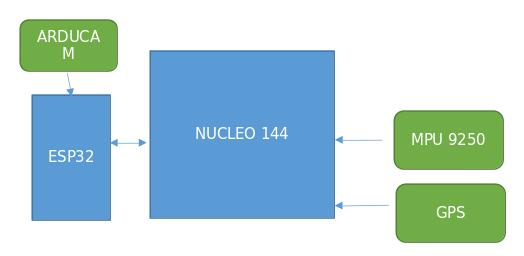

# OpenHUDware.sky

This was my first DIY drone. Built on the cheap using an untested flight controller I banged together out of a couple of dev boards and the ARDUPILOT code.

## Goals
* basic remote control flight
* autonomous flight (GPS waypoint etc)
* camera feed (only while within TX distance)
* object avoidance
* facial recognition
* gesture control

### components
	brain
    ▪ ESP32-S3-WROOM-1-N8 DEV BRD AU$22.31
    ▪ NUCLEO-144 STM32F767 DEV EVAL BD AU$36.39
    ▪ ARDUCAM 5MP PLUS OV5642 MINI CAM AU$73.17
    ▪ GPS MODULE W/ ANTENNA (NEO-M8N) AU$54.88
    ▪ MPU-9250 GY-9250 9-axis gyro AU $11.79

	base
    • F450 Flame Wheel KIT Drone With Camera 450 Frame For RC MK MWC 4 Axis RC Multicopter Quadcopter Heli Multi-Rotor with Land Gear AU$22.31
    • 2205 2300KV CW CCW Brushless Motor With LittleBee 20A/30A BLHeli_S ESC for FPV RC QAV250 X210 Racing Drone Multicopter AU $63.25x1
    • Youme 3S Lipo Battery 11.1V 5200mah 4500mah 3300mah 6500mah 50C 60C with T Plug XT60 XT90 For RC Drone Car Monster Boat Airplane AU $37.90x1 

### .construction()
               *add references*
ESP to FC Wiring
Wiring is very simple, and similar for all devices when connecting to the Pixhawk TELEM1/2 ports. You can use 2.54mm pitch header connectors or solder the PX4 telemetry cables directly to the board.

    1. Connect UART of ESP32 to a UART of your flight controller (e.g. TELEM 1 or TELEM 2 port). Make sure the voltage levels match: most ESP32 DevKits can only take 3.3V!
        ◦ TX to RX
        ◦ RX to TX
        ◦ GND to GND
        ◦ Provide a stable 3.3V or 5V power supply to the ESP32 (depending on the available inputs of your DevKit)
    2. Set the flight controller port to the desired protocol.
    3. Boards with an IPEX port for an external antenna often also offer an onboard antenna that is activated by default. You may need to resolder a resistor to activate the external antenna port.
Note
    • Follow the ESP32 board manufacturers recommendations on power supply. Some boards might have issues if they are simultaneously connected to a 5V power source and have a USB cable connected to the USB/Serial bridge (USB socket of the ESP32 dev board).
    • Some ESP32 DevKits manufacturers use the wrong labels for the pins on their products. Make sure that the PINs on your board are labeled correctly if you encounter issues.

## Firmware/Software
* Adrupilot on nucleo 144
* Dronebridge on esp32

ESP32 are readily available WiFi modules with dedicated UART, SPI and I2C interfaces, and full TCP/IP stack and microcontroller capability. They come without firmware, but DroneBridge for ESP32 can be installed to enable them as a transparent and bi-directional serial to WiFi bridge. They can then be used as a WiFi telemetry module with any Pixhawk series controller. No configuration is generally required if connected to TELEM2. The typical range is approximately 50m-200m (depending on the antenna used).

WARNING
Many ESP32 modules support 3.3V and 5V power supply input, while some flight controllers (e.g. Pixhawk 4) output at 5V. You will need to check compatibility and step down the voltage if needed.

The instructions on Github are recommended because they are always up to date. Note that the parameters may differ between releases of DroneBridge for ESP32.
The main steps are:
    1. Download the pre-compiled firmware binaries(opens new window)
    2. Connect your DEVKit to your computer via USB/Serial bridge (most DevKits already offer a USB port for flashing and debugging)
    3. Erase the flash and flash the DroneBridge for ESP32 firmware onto your ESP32
        ◦ Using Espressif Flash Download Tool (opens new window)(Windows only)
        ◦ Using esp-idf/esptool (all platforms)
    4. Power Cycle the ESP32
    5. Connect to the "DroneBridge for ESP32" WiFi network and configure the firmware for your application
       
